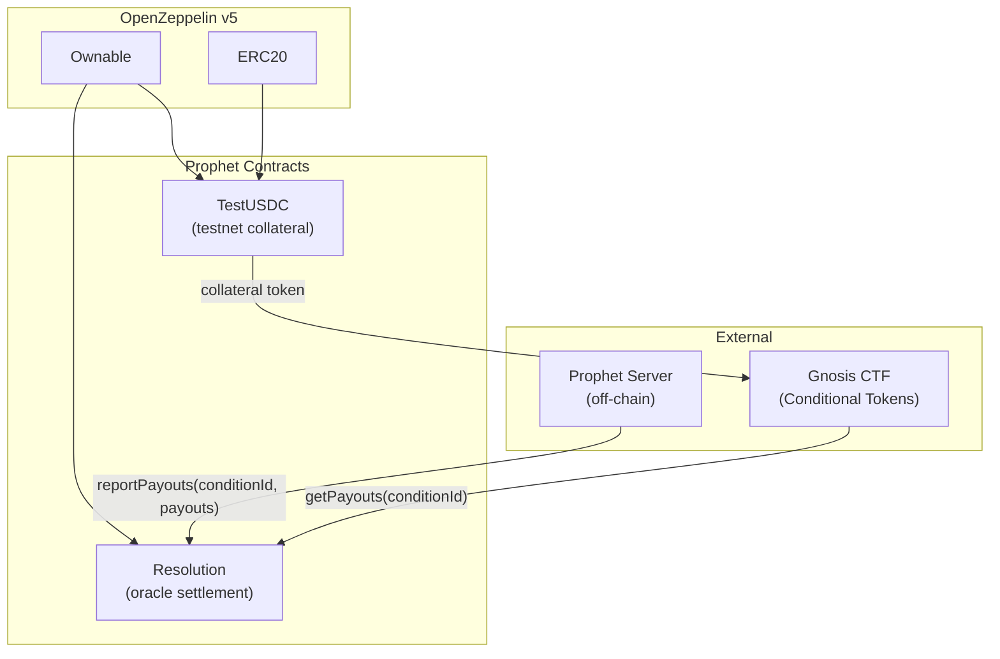
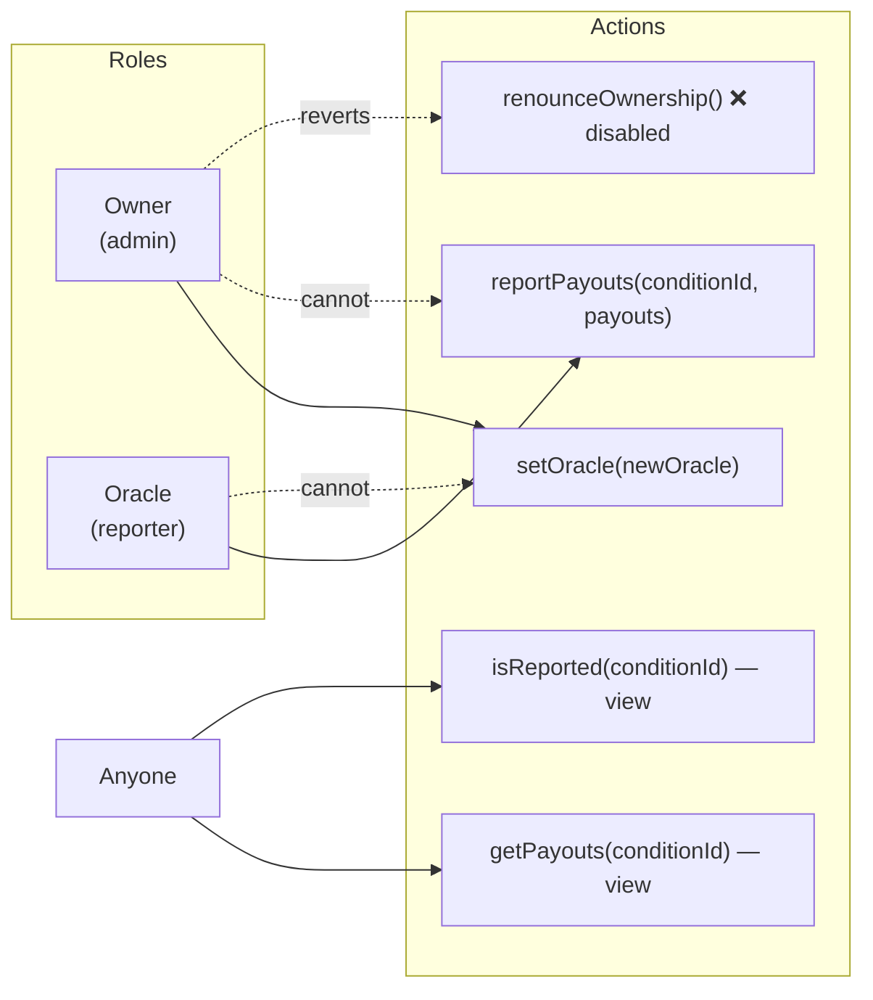
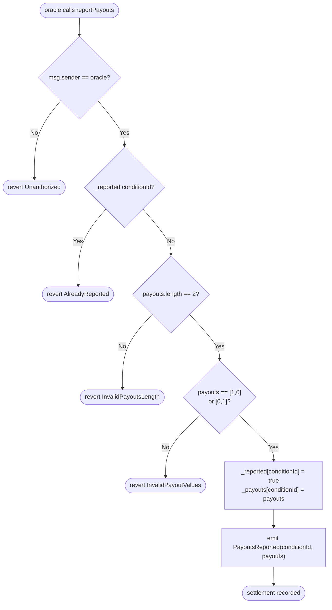
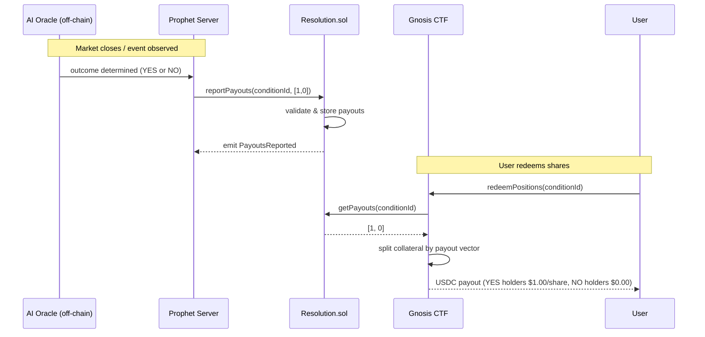
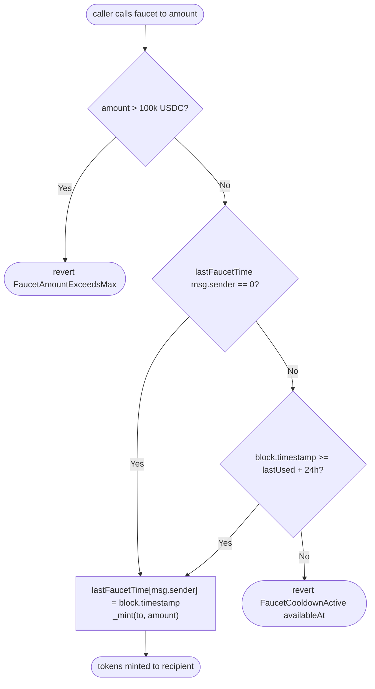
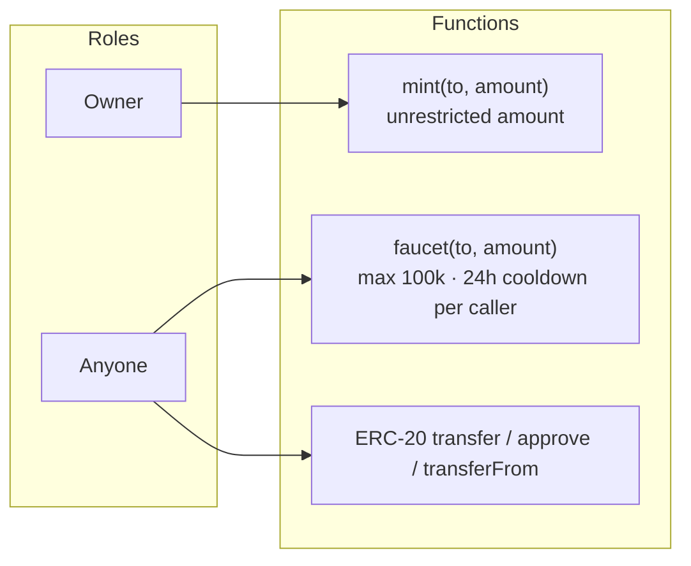

# contracts/

Smart contracts for Prophet's on-chain settlement system. Built with Foundry and OpenZeppelin v5.

The system has two contracts: `Resolution` acts as the AI oracle that records the outcome of every prediction market, and `TestUSDC` is a testnet-only ERC-20 that serves as the collateral token during development. `Resolution` integrates with the Gnosis Conditional Tokens Framework (CTF) — it stores the binary payout vectors that the CTF uses to redeem shares when a market settles.

## Files

| File | Description |
|------|-------------|
| `src/Resolution.sol` | AI oracle that stores immutable binary payout reports per `conditionId` for Prophet prediction markets |
| `src/TestUSDC.sol` | Testnet-only ERC-20 mimicking USDC with 6 decimals, a public faucet, and owner-only mint |
| `test/Resolution.t.sol` | Foundry unit and fuzz test suite for `Resolution` |
| `test/TestUSDC.t.sol` | Foundry unit and fuzz test suite for `TestUSDC` |
| `foundry.toml` | Foundry build configuration and OpenZeppelin remappings |

## Diagrams

### Contract Architecture



### Role Model — Resolution



> Owner and oracle are always separate addresses. The separation ensures that compromising the oracle key cannot affect role management, and vice versa.

### reportPayouts — Validation Flow



### Market Resolution — End-to-End Flow



### TestUSDC — Faucet Flow



> Cooldown is tracked on `msg.sender` (the caller), not `to` (the recipient). A single bot wallet can fund multiple test addresses by using the owner `mint()` function, or separate wallets can each call `faucet()` independently.

### TestUSDC — Access Control



## API Reference

### Resolution

| Function | Access | Description |
|----------|--------|-------------|
| `constructor(initialOwner, initialOracle)` | — | Deploys with owner and oracle set; reverts if oracle is `address(0)` |
| `reportPayouts(conditionId, payouts)` | `onlyOracle` | Records `[1,0]` (YES) or `[0,1]` (NO); write-once, immutable |
| `setOracle(newOracle)` | `onlyOwner` | Rotates the oracle address; reverts on `address(0)` |
| `renounceOwnership()` | — | Always reverts — disabled to protect oracle management |
| `getPayouts(conditionId)` | view | Returns payout array; empty if not yet reported |
| `isReported(conditionId)` | view | Returns `true` once payouts have been recorded |

**Events**

| Event | Emitted when |
|-------|-------------|
| `PayoutsReported(bytes32 indexed conditionId, uint256[] payouts)` | Oracle successfully records an outcome |
| `OracleTransferred(address indexed previousOracle, address indexed newOracle)` | Oracle role is set (including on deployment) |

**Errors**

| Error | Trigger |
|-------|---------|
| `Unauthorized()` | `msg.sender` is not the oracle |
| `AlreadyReported(bytes32 conditionId)` | Attempting to report an already-settled condition |
| `InvalidPayoutsLength(uint256 length)` | Payout array is not exactly length 2 |
| `InvalidPayoutValues()` | Array is not exactly `[1,0]` or `[0,1]` |
| `ZeroAddress()` | Oracle set to `address(0)` |
| `RenounceDisabled()` | `renounceOwnership()` called |

---

### TestUSDC

| Function | Access | Description |
|----------|--------|-------------|
| `constructor(initialOwner)` | — | Deploys ERC-20 "Test USD Coin" / "USDC"; reverts on chain ID 137 |
| `decimals()` | view | Returns `6` (matches USDC) |
| `mint(to, amount)` | `onlyOwner` | Mints any amount to any address; no cap |
| `faucet(to, amount)` | public | Mints up to 100k USDC; one call per 24h per `msg.sender` |

**Constants**

| Constant | Value | Description |
|----------|-------|-------------|
| `FAUCET_MAX_AMOUNT` | `100_000 * 10^6` | Maximum tokens per faucet call |
| `FAUCET_COOLDOWN` | `24 hours` | Minimum time between faucet calls per caller |

**Errors**

| Error | Trigger |
|-------|---------|
| `MainnetDeploymentBlocked()` | Deployed on chain ID 137 (Polygon mainnet) |
| `FaucetAmountExceedsMax(uint256 requested, uint256 max)` | `amount > FAUCET_MAX_AMOUNT` |
| `FaucetCooldownActive(uint256 availableAt)` | Caller's cooldown has not elapsed |

## Commands

```bash
forge build                  # Compile contracts
forge test                   # Run tests
forge test -vv               # Run tests with verbose output
forge test --fuzz-runs 1000  # Increase fuzz iterations
forge fmt                    # Format Solidity files
forge fmt --check            # Check formatting without modifying
```

## Dependencies

| Package | Version | Used by |
|---------|---------|---------|
| `openzeppelin-contracts` | v5.6.0 | Both contracts (`ERC20`, `Ownable`) |
| `forge-std` | latest | Test files only (`Test`, `vm.*` cheatcodes) |

OZ is remapped in `foundry.toml`:
```toml
remappings = [
    "@openzeppelin/contracts/=lib/openzeppelin-contracts/contracts/",
]
```

## Notes

- **Payout format:** `[1, 0]` means YES wins (index 0 = YES share pays $1.00, index 1 = NO share pays $0.00). `[0, 1]` means NO wins. This maps directly to the CTF payout denominator vector and Prophet's core invariant: `1 YES + 1 NO = $1.00`.
- **conditionId:** A `bytes32` produced by the CTF's `prepareCondition(oracle, questionId, 2)`. The `Resolution` contract's address is passed as the oracle argument so the CTF knows where to fetch payouts on redemption.
- **Write-once guarantee:** Once `reportPayouts` succeeds for a `conditionId`, the record is permanent. There is no correction mechanism — submitting wrong payouts is irreversible. The AI oracle pipeline must validate outcomes before calling `reportPayouts`.
- **Oracle rotation:** Owner can replace the oracle at any time via `setOracle`. The old oracle immediately loses the ability to report. Rotation emits `OracleTransferred` for off-chain monitoring.
- **TestUSDC on Amoy:** The intended testnet is Polygon Amoy (chain ID 80002). Any chain other than 137 is accepted by the constructor.
