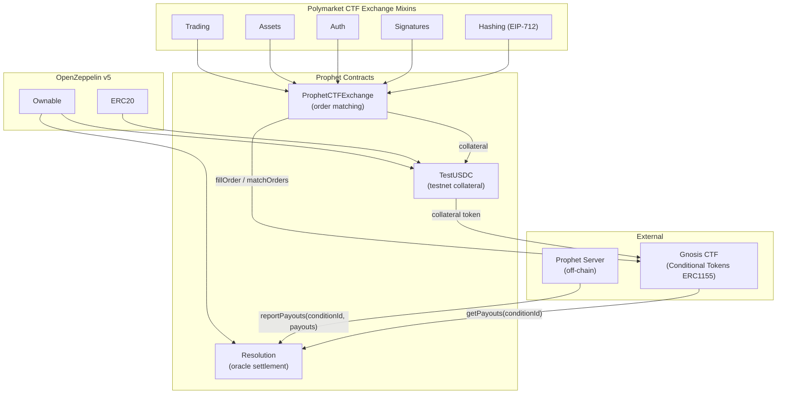
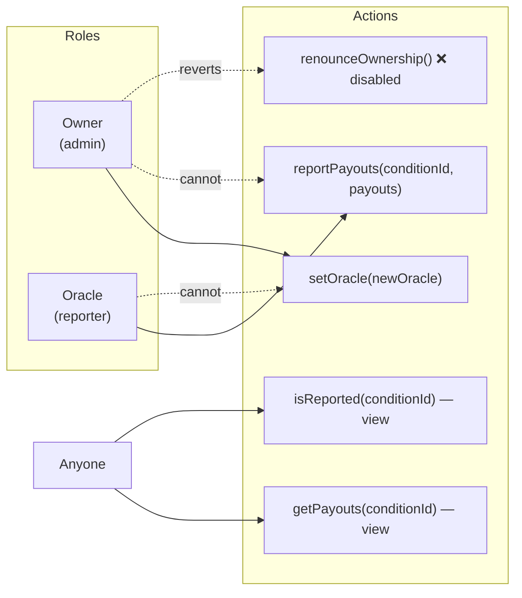
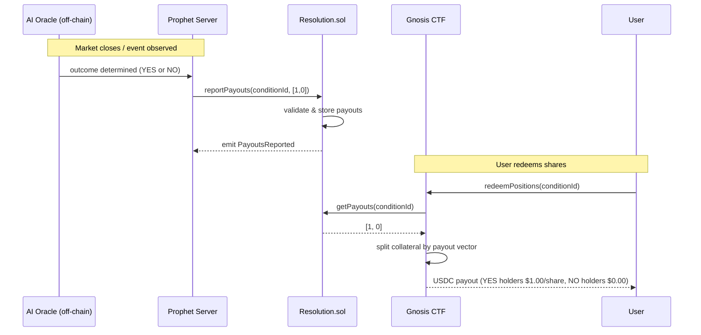
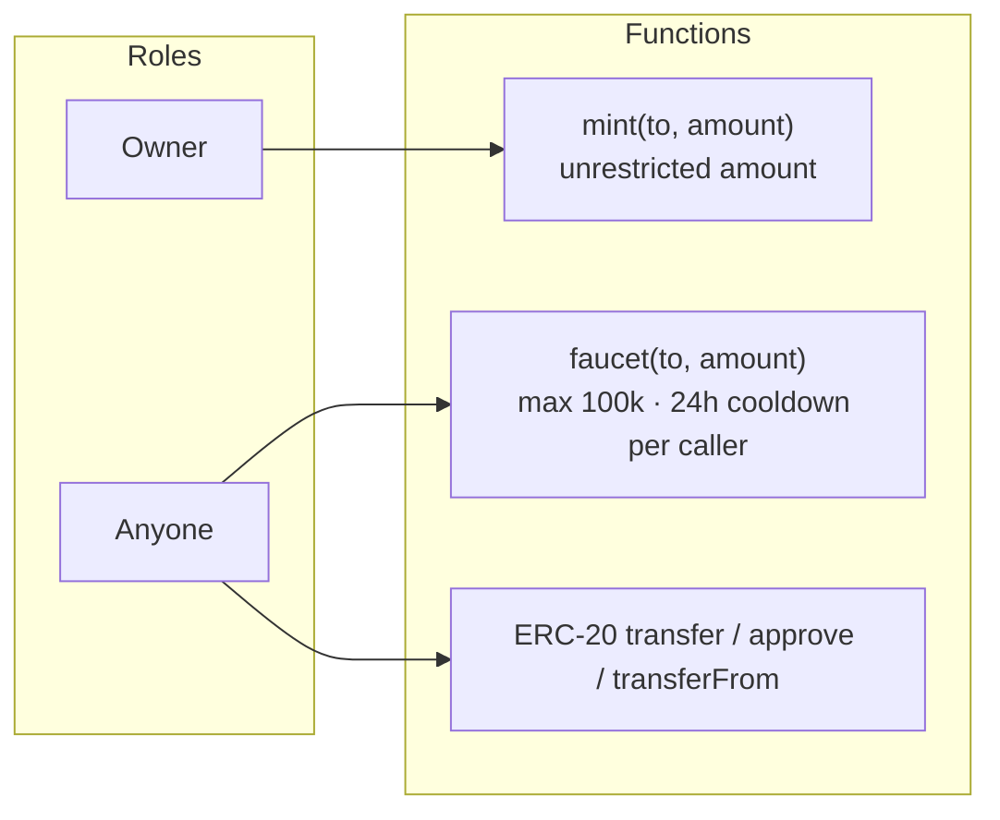

# contracts/

Smart contracts for Prophet's on-chain settlement system. Built with Foundry and OpenZeppelin v5.

The system has three contracts: `ProphetCTFExchange` is a pragma-compatible wrapper around the Polymarket CTF Exchange (MIT) that handles order matching and trading of conditional token positions. `Resolution` acts as the AI oracle that records the outcome of every prediction market. `TestUSDC` is a testnet-only ERC-20 that serves as the collateral token during development. The exchange integrates with the Gnosis Conditional Tokens Framework (CTF) — splitting USDC into YES/NO position tokens and merging them back — while `Resolution` stores the binary payout vectors the CTF uses to redeem shares when a market settles.

## Files

| File | Description |
|------|-------------|
| `src/ProphetCTFExchange.sol` | Pragma-compatible wrapper around Polymarket CTF Exchange mixins; handles order matching, trading, and asset management |
| `src/Resolution.sol` | AI oracle that stores immutable binary payout reports per `conditionId` for Prophet prediction markets |
| `src/TestUSDC.sol` | Testnet-only ERC-20 mimicking USDC with 6 decimals, a public faucet, and owner-only mint |
| `test/CTFExchange.t.sol` | 27 tests: deployment, fillOrder (buy/sell/partial), matchOrders (complementary/mint/merge), access control (registerToken dual-role, admin-only functions), expiration, pause, cancel, signature types |
| `test/Resolution.t.sol` | Foundry unit and fuzz test suite for `Resolution` |
| `test/TestUSDC.t.sol` | Foundry unit and fuzz test suite for `TestUSDC` |
| `test/mocks/MockConditionalTokens.sol` | ERC1155 mock of Gnosis CTF with real ID computation for testing the exchange |
| `test/Deploy.t.sol` | 15 tests: fresh deployment, mainnet guard, idempotency, operator/admin configuration, exchange initialization |
| `script/Deploy.s.sol` | Foundry deployment script — deploys all four contracts with idempotency and optional operator/admin configuration |
| `foundry.toml` | Foundry build configuration with `via_ir`, remappings for OZ v5 and CTF Exchange dependencies |

## Diagrams

### Contract Architecture



### Role Model — Resolution



> Owner and oracle are always separate addresses. The separation ensures that compromising the oracle key cannot affect role management, and vice versa.

### reportPayouts — Validation Flow


### Market Resolution — End-to-End Flow



### TestUSDC — Faucet Flow


> Cooldown is tracked on `msg.sender` (the caller), not `to` (the recipient). A single bot wallet can fund multiple test addresses by using the owner `mint()` function, or separate wallets can each call `faucet()` independently.

### TestUSDC — Access Control



## API Reference

### ProphetCTFExchange

Thin wrapper around the Polymarket CTF Exchange mixins (MIT). The original `CTFExchange.sol` pins `pragma solidity 0.8.15` which conflicts with OZ v5 (`^0.8.20`). This wrapper composes the same mixins (all `<0.9.0`) and is functionally identical. EIP-712 domain: `"Polymarket CTF Exchange"` version `"1"`.

| Function | Access | Description |
|----------|--------|-------------|
| `constructor(collateral, ctf, proxyFactory, safeFactory)` | — | Deploys with collateral token, CTF, and signature verification factories |
| `fillOrder(Order, fillAmount)` | `onlyOperator` | Fills a single signed order up to `fillAmount` |
| `fillOrders(Order[], fillAmounts[])` | `onlyOperator` | Batch fills multiple signed orders |
| `matchOrders(takerOrder, makerOrders[], takerFillAmount, makerFillAmounts[])` | `onlyOperator` | Matches a taker order against one or more maker orders |
| `registerToken(tokenId, complement, conditionId)` | `onlyAdmin` or `onlyOperator` | Registers a YES/NO trading pair |
| `pauseTrading()` | `onlyAdmin` | Pauses all trading operations |
| `unpauseTrading()` | `onlyAdmin` | Resumes trading |

**Match Types**

| Type | Condition | Action |
|------|-----------|--------|
| COMPLEMENTARY | BUY vs SELL | Direct token swap between taker and maker |
| MINT | Both BUY | Split USDC into YES + NO via CTF, distribute to buyers |
| MERGE | Both SELL | Merge YES + NO back into USDC via CTF, return to sellers |

**Signature Types**

| Type | Value | Description |
|------|-------|-------------|
| `EOA` | 0 | Standard ECDSA signature |
| `POLY_PROXY` | 1 | Polymarket proxy wallet signature |
| `POLY_GNOSIS_SAFE` | 2 | Gnosis Safe multisig signature |
| `POLY_1271` | 3 | EIP-1271 smart contract signature |

---

### Resolution

| Function | Access | Description |
|----------|--------|-------------|
| `constructor(initialOwner, initialOracle)` | — | Deploys with owner and oracle set; reverts if oracle is `address(0)` |
| `reportPayouts(conditionId, payouts)` | `onlyOracle` | Records `[1,0]` (YES) or `[0,1]` (NO); write-once, immutable |
| `setOracle(newOracle)` | `onlyOwner` | Rotates the oracle address; reverts on `address(0)` |
| `renounceOwnership()` | — | Always reverts — disabled to protect oracle management |
| `getPayouts(conditionId)` | view | Returns payout array; empty if not yet reported |
| `isReported(conditionId)` | view | Returns `true` once payouts have been recorded |

**Events**

| Event | Emitted when |
|-------|-------------|
| `PayoutsReported(bytes32 indexed conditionId, uint256[] payouts)` | Oracle successfully records an outcome |
| `OracleTransferred(address indexed previousOracle, address indexed newOracle)` | Oracle role is set (including on deployment) |

**Errors**

| Error | Trigger |
|-------|---------|
| `Unauthorized()` | `msg.sender` is not the oracle |
| `AlreadyReported(bytes32 conditionId)` | Attempting to report an already-settled condition |
| `InvalidPayoutsLength(uint256 length)` | Payout array is not exactly length 2 |
| `InvalidPayoutValues()` | Array is not exactly `[1,0]` or `[0,1]` |
| `ZeroAddress()` | Oracle set to `address(0)` |
| `RenounceDisabled()` | `renounceOwnership()` called |

---

### TestUSDC

| Function | Access | Description |
|----------|--------|-------------|
| `constructor(initialOwner)` | — | Deploys ERC-20 "Test USD Coin" / "USDC"; reverts on chain ID 137 |
| `decimals()` | view | Returns `6` (matches USDC) |
| `mint(to, amount)` | `onlyOwner` | Mints any amount to any address; no cap |
| `faucet(to, amount)` | public | Mints up to 100k USDC; one call per 24h per `msg.sender` |

**Constants**

| Constant | Value | Description |
|----------|-------|-------------|
| `FAUCET_MAX_AMOUNT` | `100_000 * 10^6` | Maximum tokens per faucet call |
| `FAUCET_COOLDOWN` | `24 hours` | Minimum time between faucet calls per caller |

**Errors**

| Error | Trigger |
|-------|---------|
| `MainnetDeploymentBlocked()` | Deployed on chain ID 137 (Polygon mainnet) |
| `FaucetAmountExceedsMax(uint256 requested, uint256 max)` | `amount > FAUCET_MAX_AMOUNT` |
| `FaucetCooldownActive(uint256 availableAt)` | Caller's cooldown has not elapsed |

## Commands

```bash
forge build                  # Compile contracts
forge test                   # Run tests
forge test -vv               # Run tests with verbose output
forge test --fuzz-runs 1000  # Increase fuzz iterations
forge fmt                    # Format Solidity files
forge fmt --check            # Check formatting without modifying
```

## Git Submodules

All Solidity dependencies live in `lib/` as git submodules — not copied files. Each submodule is a pointer to an exact commit in the upstream repo.

### First-time setup after cloning

After cloning the repo (or the parent monorepo), submodules start as empty directories. Initialize them:

```bash
cd contracts/
git submodule update --init --recursive
```

The `--recursive` flag is required because some dependencies have their own nested submodules (e.g. `ctf-exchange` pulls in its own `openzeppelin-contracts`, `solmate`, `solady`, and `forge-std`).

### Adding a new dependency

Use `forge install` which adds a submodule and updates `.gitmodules`:

```bash
forge install <github-org>/<repo>          # adds to lib/ and auto-commits
forge install <github-org>/<repo>@<tag>    # pin to a specific version
```

If you need to skip the auto-commit (e.g. to bundle with other changes):

```bash
forge install --no-git <github-org>/<repo>
# Then manually:
git submodule add https://github.com/<org>/<repo> lib/<repo>
```

Do **not** copy dependency source files directly into the repo.

### Updating a dependency

```bash
forge update lib/<dependency>    # pulls latest commit from upstream
```

Or pin to a specific tag/commit:

```bash
cd lib/<dependency>
git fetch
git checkout <tag-or-commit>
cd ../..
git add lib/<dependency>
```

### Removing a dependency

```bash
forge remove <dependency>
```

Or manually:

```bash
git submodule deinit lib/<dependency>
git rm lib/<dependency>
rm -rf .git/modules/lib/<dependency>
```

### Common issues

**Empty `lib/` directories after clone or checkout**
Submodules aren't fetched automatically. Run:
```bash
git submodule update --init --recursive
```

**"Unable to resolve imports" in `forge build` / `forge test`**
Usually means nested submodules weren't initialized. The `ctf-exchange` dependency has its own submodules (openzeppelin-contracts, solmate, solady). Fix with:
```bash
cd lib/ctf-exchange
git submodule update --init --recursive
cd ../..
```

**Detached HEAD inside a submodule**
This is normal. Submodules always check out a specific commit, not a branch. Don't commit changes inside `lib/` — work in a fork and point the submodule at your fork instead.

**Dirty submodule after `forge install`**
If `git status` shows the submodule as modified but you didn't change it, reset it:
```bash
git submodule update lib/<dependency>
```

**Switching branches with different submodule versions**
After checking out a branch that pins different submodule commits:
```bash
git submodule update --recursive
```

## Dependencies

| Package | Version | Used by |
|---------|---------|---------|
| `openzeppelin-contracts` | v5.6.0 | `Resolution`, `TestUSDC` (`ERC20`, `Ownable`); `MockConditionalTokens` (`ERC1155`, `SafeERC20`) |
| `ctf-exchange` | Polymarket MIT | `ProphetCTFExchange` (exchange mixins) |
| `forge-std` | latest | Test files only (`Test`, `vm.*` cheatcodes) |

Remappings in `foundry.toml`:
```toml
remappings = [
    "@openzeppelin/contracts/=lib/openzeppelin-contracts/contracts/",
    "openzeppelin-contracts/=lib/ctf-exchange/lib/openzeppelin-contracts/contracts/",
    "common/=lib/ctf-exchange/src/common/",
    "exchange/=lib/ctf-exchange/src/exchange/",
    "solady/=lib/ctf-exchange/lib/solady/src/",
]
```

> The exchange mixins use OZ v4 internally (via the bare `openzeppelin-contracts/` remapping), while Prophet contracts use OZ v5 (via `@openzeppelin/contracts/`). Both coexist through separate remapping paths.

## Notes

- **ProphetCTFExchange vs CTFExchange:** The original Polymarket `CTFExchange.sol` uses `pragma solidity 0.8.15` which cannot compile alongside OZ v5 (`^0.8.20`). `ProphetCTFExchange` inherits the same mixins (all `pragma solidity <0.9.0`) and is functionally identical. The `via_ir` compiler flag is required due to the deep inheritance stack.
- **Operator model:** All trading functions (`fillOrder`, `matchOrders`) require `onlyOperator` — Prophet's relayer wallet submits matched trades on behalf of users.
- **Payout format:** `[1, 0]` means YES wins (index 0 = YES share pays $1.00, index 1 = NO share pays $0.00). `[0, 1]` means NO wins. This maps directly to the CTF payout denominator vector and Prophet's core invariant: `1 YES + 1 NO = $1.00`.
- **conditionId:** A `bytes32` produced by the CTF's `prepareCondition(oracle, questionId, 2)`. The `Resolution` contract's address is passed as the oracle argument so the CTF knows where to fetch payouts on redemption.
- **Write-once guarantee:** Once `reportPayouts` succeeds for a `conditionId`, the record is permanent. There is no correction mechanism — submitting wrong payouts is irreversible. The AI oracle pipeline must validate outcomes before calling `reportPayouts`.
- **Oracle rotation:** Owner can replace the oracle at any time via `setOracle`. The old oracle immediately loses the ability to report. Rotation emits `OracleTransferred` for off-chain monitoring.
- **TestUSDC on Amoy:** The intended testnet is Polygon Amoy (chain ID 80002). Any chain other than 137 is accepted by the constructor.
