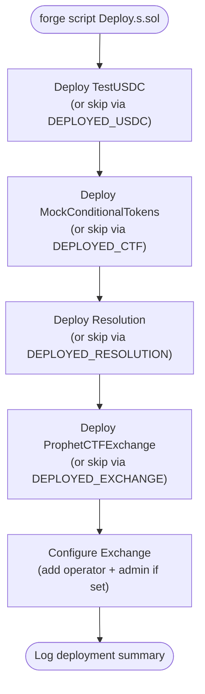

# Deployment Scripts

Foundry scripts that deploy and configure Prophet's smart contracts. The deployment is idempotent — set `DEPLOYED_*` environment variables to skip contracts that are already on-chain. Each pre-deployed address is validated via a code-size check before being accepted.

## Files

| File | Description |
|------|-------------|
| Deploy.s.sol | Deploys TestUSDC, MockConditionalTokens, Resolution, and ProphetCTFExchange in order; configures operator and admin roles on the exchange |

## Diagrams

### Deployment Order



## Usage

```bash
# 1. Import deployer key into Foundry's encrypted keystore (one-time)
cast wallet import prophet-deployer --interactive

# 2. Optional — skip already-deployed contracts
export DEPLOYED_USDC=0x...
export DEPLOYED_CTF=0x...
export DEPLOYED_RESOLUTION=0x...
export DEPLOYED_EXCHANGE=0x...

# 3. Optional — configure exchange roles
export OPERATOR_ADDRESS=0x...
export ADMIN_ADDRESS=0x...

# 4. Deploy (keystore)
forge script script/Deploy.s.sol \
  --account prophet-deployer \
  --sender <DEPLOYER_ADDR> \
  --rpc-url $RPC_URL \
  --broadcast

# Alternative: hardware wallet (Ledger)
forge script script/Deploy.s.sol \
  --ledger \
  --sender <DEPLOYER_ADDR> \
  --rpc-url $RPC_URL \
  --broadcast
```

## Notes

- **Idempotency:** Set `DEPLOYED_USDC`, `DEPLOYED_CTF`, `DEPLOYED_RESOLUTION`, or `DEPLOYED_EXCHANGE` env vars to skip already-deployed contracts. Each address is validated via `addr.code.length > 0`.
- **Signer:** The script calls `vm.startBroadcast()` with no arguments — Foundry resolves the signer from CLI flags (`--account`, `--ledger`, `--sender`, etc.). Use an encrypted keystore or hardware wallet; raw private keys are not supported.
- **Optional env vars:** `OPERATOR_ADDRESS` (registers a separate operator on the exchange), `ADMIN_ADDRESS` (adds an additional admin on the exchange).
- **Safe infrastructure:** Requires `SAFE_FACTORY_ADDRESS` env var pointing to the Poly SafeProxyFactory deployed by `contracts-poly-safe/`. The exchange reads the singleton address from the factory's `masterCopy()`.
- **Resolution oracle:** The deployer is set as both owner and initial oracle. The oracle role can be transferred later via `setOracle()`.
