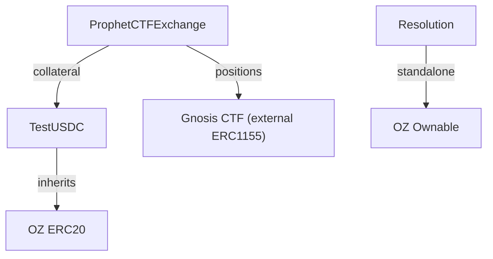

# Source Contracts

Prophet's on-chain prediction market infrastructure: the CTF Exchange wrapper, testnet USDC token, and market resolution oracle.

## Files

| File | Description |
|------|-------------|
| ProphetCTFExchange.sol | Wrapper around Polymarket's CTF Exchange mixins (^0.8.20 compatible); handles order matching, trading, asset management, and pause controls |
| TestUSDC.sol | Testnet-only ERC-20 token (6 decimals) with owner mint and public faucet (24h cooldown, 100k max per call); blocks mainnet deployment |
| Resolution.sol | Oracle contract that records YES/NO payout outcomes per conditionId; admin controls oracle role, oracle reports payouts |

## Architecture

### ProphetCTFExchange

Thin wrapper around the Polymarket CTF Exchange mixins (MIT license). The original `CTFExchange.sol` pins `pragma solidity 0.8.15` which conflicts with OZ v5 (`^0.8.20`). This wrapper composes the same mixins (all `<0.9.0`) and is functionally identical. EIP-712 domain: `"Polymarket CTF Exchange"` version `"1"`.

Key functions:
- `fillOrder(Order, fillAmount)` — Operator fills a single signed order
- `matchOrders(takerOrder, makerOrders[], takerFillAmount, makerFillAmounts[])` — Operator matches orders
- `registerToken(token, complement, conditionId)` — Admin registers a trading pair

Match types:
- **COMPLEMENTARY** (BUY vs SELL) — Direct token swap
- **MINT** (both BUY) — Split USDC into YES + NO via CTF
- **MERGE** (both SELL) — Merge YES + NO back into USDC via CTF

## Notes

- All trading functions require `onlyOperator` — Prophet's operator wallet submits matched trades.
- `TestUSDC` reverts on chain ID 137 (Polygon mainnet) to prevent accidental deployment.
- `Resolution` payouts are binary: exactly one outcome gets payout 1, the other gets 0.
